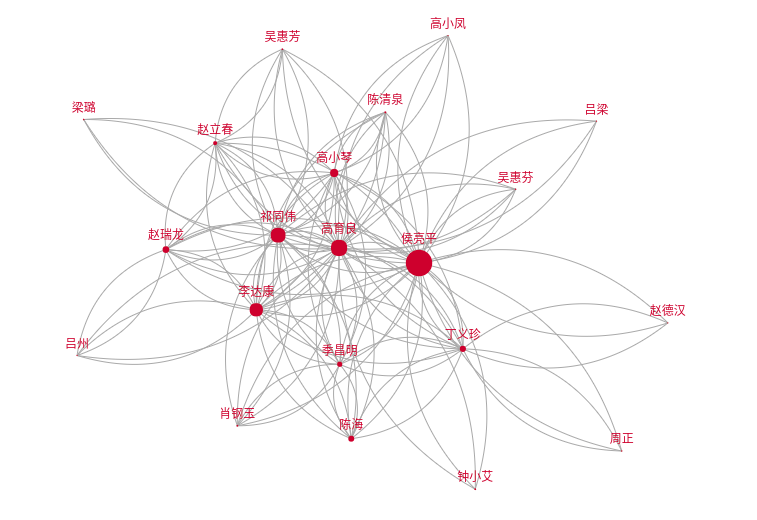
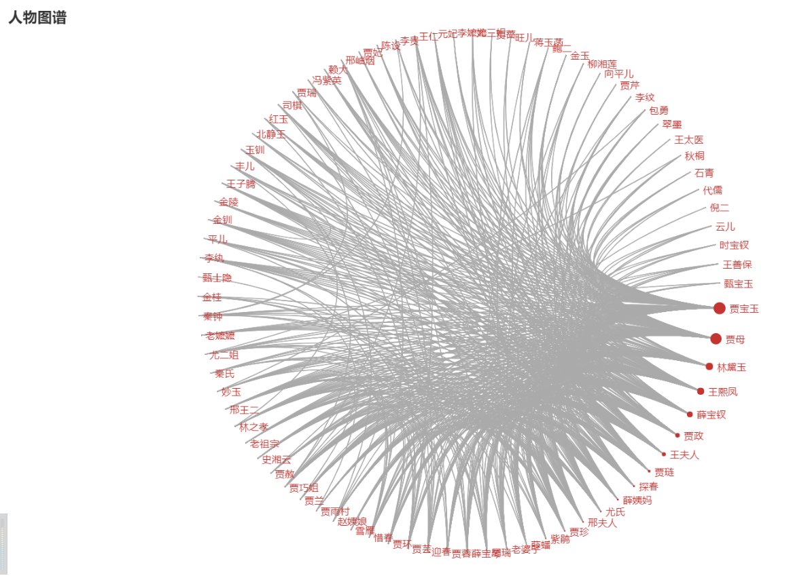

# 人物关系图谱

使用pyecharts画《人民的名义》和《红楼梦》人物关系图谱

### people.py

用于绘制图谱

在get_people()函数中更改文件名：

​	人民的名义是people_content.txt，红楼梦是hlm_content.txt

在stopwods.txt中增加不想出现的名字

在replace.xlsx中增加替换的名字

### crawler.py

用于爬取人民的名义剧情梗概

### 结果如下：

人民的名义：

红楼梦：

